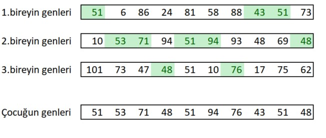

# Genetik Algoritma Temelleri

Elimizde 1 milyar satırdan ve 100 sütundan oluşan devasa bir veri setimiz olduğunu düşünelim. Her bir satırdaki değerlere belirli işlemler uygulayacağımız f(x) fonksiyonumuz olsun. Bir satır için bu fonksiyonun çıktısını bulmak 1 saniyemizi alıyor olsun. Problemimiz ise bu veri setinde bu fonksiyonun çıktısının en fazla yapan değeri bulmak. Nasıl yaparız?

İlk akla gelen yöntem bütün satırların fonksiyon çıktısını bulduktan sonra sıralayıp en yüksek değeri bulmak olur. Peki bu pratikte mümkün müdür? 
1 milyar satırın her birinin cevabını bulmak 1 milyar saniye alır. Bu yaklaşık 277 777 saat sürmesi demek. Yani 11 574 yıl sürmesi demek. Eğer yeterli sabrınız varsa ve bu süreyi beklemeye karar verdiyseniz şuanda uyguladığınız yöntem Computer Force tekniğidir. Ama bu teknik hem süre açısından hem de maliyet açısından pek de iç açıcı değil.

İşte tam da böyle durumlar için başvurulabilecek birçok teknik vardır. Bu tekniklerin büyük bir kısmına Optimizasyon Teknikleri denmektedir. Bu teknikler bize tam olarak şunu vaadediyor: Verinin tamamına bakmadan sadece bir kısmına bakarak global maksimumu ya da minimumu bulmak. 
Yıllarca çok çeşitli optimizasyon teknikleri geliştirildi. Bunlardan ise en başarılılarından bir tanesi Genetik Algoritmalar. 

GENETİK ALGORİTMA 
Genetik Algoritmalar doğadaki evrimsel süreci taklit eden algoritmalardır. Mutasyon, çaprazlama ve doğal seçilim sonunda nasıl ki şuanki karmaşık ve çevresiyle en mükemmele yakın uyumdaki canlılar oluştuysa genetik algoitmalar da bunu taklit etmeye çalışmaktadır. Aynı şekilde verisetimiz evrimsel süreçteki doğayı temsil ederken fonksiyon çıktısı ise o doğadaki canlının hayatta kalma performansıdır ki bu değere de fitness değeri diyeceğiz.

Hem kod üzerinden görmek için hem de adımları daha iyi anlamak için ilk önce yapay bir veriseti oluşturalım. Herkes bilgisayarında rahatça çalıştırabilmesi için fiziksel hafızayı çok doldurmayacak büyüklükte bir veri seti üretelim. 

```
import pandas as pd 
from random import randint

population = []
for row in range(1,10_000): #10 000 satırdan oluşacak
    row_i = []
    for column in range(10): #10 sütundan oluşacak
        row_i.append(randint(1, 101)) #her değer 1 ile 100 arasındaki rastgele seçilmiş bir veriden oluşacak 
    population.append(row_i)

population = pd.DataFrame(population)

population["fitness"] = None
```

Elimizdeki populasyon aşağıdaki gibi oluştu.


````
       0   1    2    3   4   5   6    7   8   9 fitness
0     59  98    8   30  41  91   8  101  53  51    None
1     74  82    8   85  92  64  37   94  96  13    None
2     66  70   88   91  23  68  57   14  17  92    None
3     92  97   82   45  19  88  27   27  65  63    None
4      1  15   34   64  11  34  18   75  75   7    None
  ..  ..  ...  ...  ..  ..  ..  ...  ..  ..     ...
9995  93  61  101   62  16  32  46   14  30  97    None
9996  23  74   20   57  55  85  54   63  97  46    None
9997  99  13   49   15  31  28  36   90  72  17    None
9998  21  64   55  100  71  34  27   77  36  73    None
9999  37  44   74   43   5  74  41   91  25  44    None

[10000 rows x 11 columns]
````


Genetik algoritmaların ilk adımı 0.Nesili üretmeyle başlar. Bu nesil tamamen rastgele olacak şekilde toplam populasyon içerisinden rastgele seçilerek belirlenir. Tüm nesillerde olacak canlı sayısını 100 kabul edelim. 

````
sample     = 100  
generation = population.sample(n=sample)
````

0.nesilimiz aşağıdaki gibi oldu. 
````
       0   1    2   3   4   5   6   7    8   9 fitness
6182  88  35   99   2  56  86  55  17   80  67    None
478   69  34   69  53   7  36  23   4   56  76    None
1658  19  88   65  30  96  44  50  29   78  36    None
5866  50  12   87  83   3  99  32  18   85  22    None
138   85  37   86  94  17  91  16  56   24  87    None
  ..  ..  ...  ..  ..  ..  ..  ..  ...  ..     ...
9565  72  56    9  41   7   8  80  38   93  69    None
2080  14  87   14  45  16  55  86  28  100   9    None
8301  43  86   29  74  24  39  49  47   95  38    None
4905  90  27   38  33  13  73  45  13   85  56    None
997   34  56  100  80  66  35  10  80   87  83    None

[100 rows x 11 columns]
````


Rastgele seçilen 100 tane bireyin fitness değerleri yani fonksiyon çıktıları bulunur. Başka bir değişle doğadaki hayatta kalma performasını ölçeriz. Buna da örnek vermek için yapay bir fonksiyon yazalım. Fonksiyonumuz satırdaki değerleri önce toplasın sonra da 0 ile 1 arasında rastgele seçtiği bir float değer ile çarpsın. Aynı zamanda da bu fonksiyonun aslında daha da uzun işlemler yaptığını temsil etmesi için 1 saniye beklesin. 

````
def function(row):
    summ = sum(row)
    time.sleep(1)
    return summ*random.random()
````


Fonksiyonumuz da hazır olduğuna göre artık 0.nesilimizin hayatta kalma becerilerini yani fitness değerlerini ölçebiliriz. 
````
for i in range(len(generation)):
    generation.iloc[i,-1] = function(generation.iloc[i,:-1])
````

````
       0   1    2   3   4   5   6   7    8   9     fitness
6182  88  35   99   2  56  86  55  17   80  67  484.368798
478   69  34   69  53   7  36  23   4   56  76    83.19301
1658  19  88   65  30  96  44  50  29   78  36   41.402957
5866  50  12   87  83   3  99  32  18   85  22   26.775706
138   85  37   86  94  17  91  16  56   24  87  178.546772
  ..  ..  ...  ..  ..  ..  ..  ..  ...  ..         ...
9565  72  56    9  41   7   8  80  38   93  69   16.967912
2080  14  87   14  45  16  55  86  28  100   9  203.347371
8301  43  86   29  74  24  39  49  47   95  38   180.24441
4905  90  27   38  33  13  73  45  13   85  56  364.976167
997   34  56  100  80  66  35  10  80   87  83  240.830114

[100 rows x 11 columns]
````

Artık elimizde hayatta kalma performanslarını ölçtüğümüz 100 birey var. Ama doğa oldukça vahşi. Bize çok daha iyi bireyler gerekiyor. Belki 0.nesilde rastgele birey alırken gerçekten de global maksimuma denk gelmiş de olabiliriz fakat bunun garantisini veremeyiz. 
Bu yüzden 1.nesile geçiyoruz. Bu nesilde artık çaprazlama ve mutasyon yapmamız gerekiyor. 

Çaprazlama yapmadan önce elimizdeki bulunan 100 bireyden fitness değerlerinin en yüksek olan 10 tanesini alalım.  

````
#generation listesini fitness değerine göre büyükten küçüğe sıraladık.
generation = generation.sort_values(by="fitness", ascending=False) 

# en iyi fitness değerine sahip ilk 10 bireyi alıp besties listesini oluşturduk.
besties    = generation.iloc[:10, :]
````

0.nesildeki en iyi 10 bireyimiz aşağıdaki gibi oldu.
````
        0   1   2   3   4   5   6   7   8    9     fitness
5710   51   6  86  24  81  58  88  43  51   73  554.281819
4954   10  53  71  94  51  94  93  48  69   48   553.05692
3822  101  73  47  48  51  10  76  17  75   62  551.962846
6783   27  94  90  18  81  71  67  26  28   87  529.336105
1693    9  85  85  99  84  47  90  93  63   10  529.249015
8368   99  52  35  48  37  36  79   8  49  101  511.083666
5810   57  92  26  83  57  81   8  16  87   53  502.527068
5107   56  96  86  73  31  28  33  87  87   93  485.875843
6182   88  35  99   2  56  86  55  17  80   67  484.368798
3340   94  72  81  36  89  66  33  20  61   24  468.197003
````

Artık bu en iyi genlere sahip ilk 10 bireyden yeni bireyler üretebiliriz.  Çaprazlama yaparken çeşitli teknikler uygulanabilmektedir. Daha da karmaşıklaştırmamak için en basitlerinden bir tanesi ile yola devam edelim. Crossover (Çaprazlama) adında bir fonksiyon yazalım. Bu fonksiyon en iyiler listemizi alıp bunların genlerinden karma yaparak yeni bireyler üretsin. Bu fonksiyonun çeşitli algoritmalarla yazılabilir. 

````
def crossover(besties):
    childs = []
    for i in range(50):
        cocuk = []
        for j in range(10):
            # besties listesindeki her sütundan rastgele bir sayı seçiyoruz.
            cocuk.append(random.choice(besties.iloc[:,j].values)) 
        childs.append(cocuk)
    childs = pd.DataFrame(childs)
    return childs

childs = crossover(besties)
````

Çaprazlamanın nasıl çalıştığına dair bir örneği aşağıda görebilirsiniz. 



Artık elimizde 50 tane çocuk var. Her nesili 100 bireye tamamlamak için 50 tane mutasyon yapalım. Mutasyon elimizdeki toplam populasyondan tamamen rastgele 50 birey almaktan farklı bir şey değil. 

````
def mutation(population):
    mutant = population.sample(n=50)
    return mutant
    
mutant = mutation(population)
````

Artık çocukları ve mutantları birleştirip 1.nesili oluşturabiliriz. 
````
generation = pd.concat([childs,mutant])

       0   1   2   3   4   5   6   7    8   9 fitness
0     94  92  26  36  31  10  76   8   87  73    None
1     88  53  35  24  56  28  67  43   61  48    None
2     56  73  26  83  89  86  76  26   75  62    None
3     56  96  81  18  57  86  55  20   63  62    None
4     88  52  35   2  31  81  33  20   61  48    None
  ..  ..  ..  ..  ..  ..  ..  ..  ...  ..     ...
4187   3   2  83   2   7  46  94  78   12  51    None
934   99  30  32  83  60  82  23  68    4  99    None
2042  88  39  43  99  94  23  84  56  100  28    None
6557  58   5  62  29   4  26  91  20   62  91    None
6196  34  97  16  52  60  61  97  95   59   5    None

[100 rows x 11 columns]

````

1.nesili de oluşturduktan sonraki işlem artık bu bireylerin fitness değerlerini bulmak. Sonrasında tekrar aynı süreçleri izleyerek n iterasyon sonunda artık global maksimumu ya da global minimumu bulmak mümkün. Buradaki temel sorun ise iterasyonu durdurma şartımız ne olacak? Burada literatürde farklı yaklaşımlar mevcut. Yaklaşımlardan biri doğrudan iterasyon limiti koymaktır. Mesela 500 iterasyon yani 500 nesil aynı süreci izle ve bulunan en yüksek fitness değerine sahip birey en iyi bireydir. Diğer bir yaklaşım ise her nesildeki en iyiler listesinin fitness değerleri birbirine yaklaşıyorsa yani standart sapması azalıyorsa artık global maksimuma ya da global minimuma ulaşmış demektir. 


 


