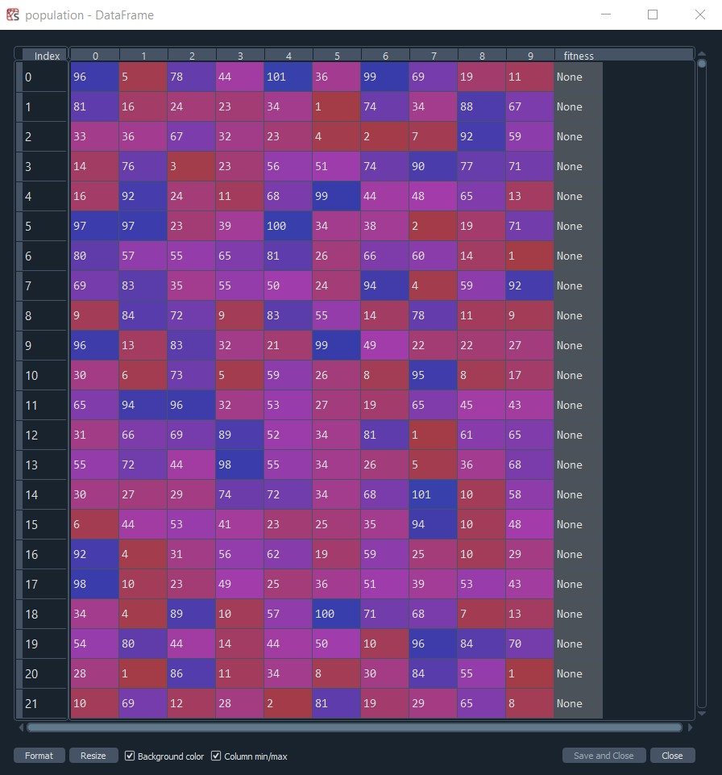
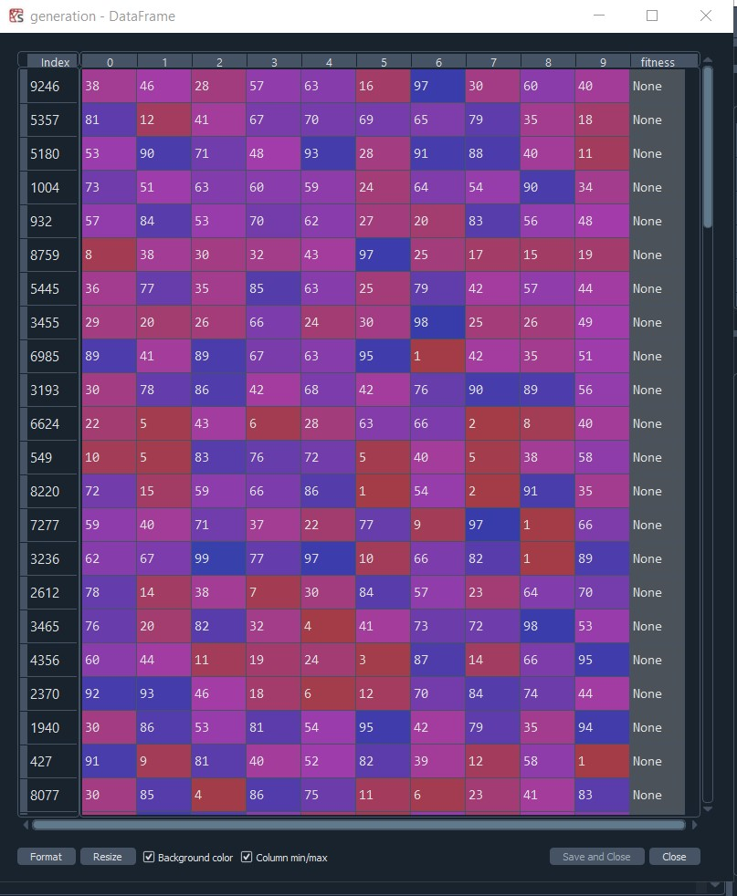

# GeneticAlgorithm
Genetik Algoritma'nın temelleri

Elimizde 1 milyar satırdan ve 100 sütundan oluşan devasa bir veri setimiz olduğunu düşünelim. Her bir satırdaki değerlere belirli işlemler uygulayacağımız f(x) fonksiyonumuz olsun. Bir satır için bu fonksiyonun çıktısını bulmak 1 saniyemizi alıyor olsun. Problemimiz ise bu veri setinde bu fonksiyonun çıktısının en fazla yapan değeri bulmak. Nasıl yaparız?

İlk akla gelen yöntem bütün satırların fonksiyon çıktısını bulduktan sonra sıralayıp en yüksek değeri bulmak olur. Peki bu pratikte mümkün müdür? 
1 milyar satırın her birinin cevabını bulmak 1 milyar saniye alır. Bu yaklaşık 277 777 saat sürmesi demek. Yani 11 574 yıl sürmesi demek. Eğer yeterli sabrınız varsa ve bu süreyi beklemeye karar verdiyseniz şuanda uyguladığınız yöntem Computer Force tekniğidir. Ama bu teknik hem süre açısından hem de maliyet açısından pek de iç açıcı değil.

İşte tam da böyle durumlar için başvurulabilecek birçok teknik vardır. Bu tekniklerin büyük bir kısmına Optimizasyon Teknikleri denmektedir. Bu teknikler bize tam olarak şunu vaadediyor: Verinin tamamına bakmadan sadece bir kısmına bakarak global maksimumu ya da minimumu bulmak. 
Yıllarca çok çeşitli optimizasyon teknikleri geliştirildi. Bunlardan ise en başarılılarından bir tanesi Genetik Algoritmalar. 

GENETİK ALGORİTMA 
Genetik Algoritmalar doğadaki evrimsel süreci taklit eden algoritmalardır. Mutasyon, çaprazlama ve doğal seçilim sonunda nasıl ki şuanki karmaşık ve çevresiyle en mükemmele yakın uyumdaki canlılar oluştuysa genetik algoitmalar da bunu taklit etmeye çalışmaktadır. Aynı şekilde verisetimiz evrimsel süreçteki doğayı temsil ederken fonksiyon çıktısı ise o doğadaki canlının hayatta kalma performansıdır ki bu değere de fitness değeri diyeceğiz.

Hem kod üzerinden görmek için hem de adımları daha iyi anlamak için ilk önce yapay bir veriseti oluşturalım. Herkes bilgisayarında rahatça çalıştırabilmesi için fiziksel hafızayı çok doldurmayacak büyüklükte bir veri seti üretelim. 

```
import pandas as pd 
from random import randint

population = []
for row in range(1,10_000): #10 000 satırdan oluşacak
    row_i = []
    for column in range(10): #10 sütundan oluşacak
        row_i.append(randint(1, 101)) #her değer 1 ile 100 arasındaki rastgele seçilmiş bir veriden oluşacak 
    population.append(row_i)

population = pd.DataFrame(population)

population["fitness"] = None
```

Elimizdeki populasyon aşağıdaki gibi oluştu.




Genetik algoritmaların ilk adımı 0.Nesili üretmeyle başlar. Bu nesil tamamen rastgele olacak şekilde toplam populasyon içerisinden rastgele seçilerek belirlenir. Tüm nesillerde olacak canlı sayısını 100 kabul edelim. 

````
sample     = 100  
generation = population.sample(n=sample)
````

0.nesilimiz aşağıdaki gibi oldu. 



Rastgele seçilen 100 tane bireyin fitness değerleri yani fonksiyon çıktıları bulunur. Başka bir değişle doğadaki hayatta kalma performasını ölçeriz. Buna da örnek vermek için yapay bir fonksiyon yazalım. Fonksiyonumuz satırdaki değerleri önce toplasın sonra da 0 ile 1 arasında rastgele seçtiği bir float değer ile çarpsın. Aynı zamanda da bu fonksiyonun aslında daha da uzun işlemler yaptığını temsil etmesi için 1 saniye beklesin. 

````
def function(row):
    summ = sum(row)
    time.sleep(1)
    return summ*random.random()
````


Fonksiyonumuz da hazır olduğuna göre artık 0.nesilimizin hayatta kalma becerilerini yani fitness değerlerini ölçebiliriz. 
````
for i in range(len(generation)):
    generation.iloc[i,-1] = function(generation.iloc[i,:-1])
````


Artık elimizde hayatta kalma performanslarını ölçtüğümüz 100 birey var. Ama doğa oldukça vahşi. Bize çok daha iyi bireyler gerekiyor. Belki 0.nesilde rastgele birey alırken gerçekten de global maksimuma denk gelmiş de olabiliriz fakat bunun garantisini veremeyiz. 
Bu yüzden 1.nesile geçiyoruz. Bu nesilde artık çaprazlama ve mutasyon yapmamız gerekiyor. 

Çaprazlama yapmadan önce elimizdeki bulunan 100 bireyden fitness değerlerinin en yüksek olan 10 tanesini alalım.  


